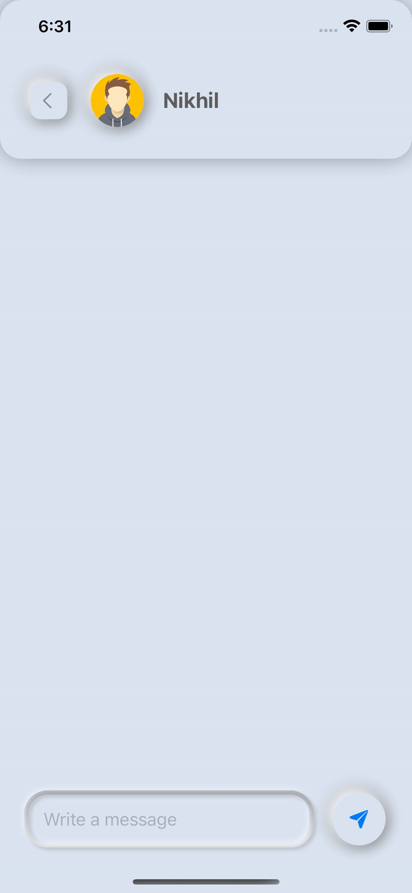

# NeumorphicChatController

This repository contains the code for a neumorphic chat screen built using SwiftUI. The chat screen has a modern and sleek neumorphic design, which gives it a soft and interactive appearance.

## Preview

| Light Mode                                             | Dark Mode                                            |
| ------------------------------------------------------ | ---------------------------------------------------- |
|  |  |

## Features

- Neumorphic design with soft shadows and rounded corners
- Displaying chat messages
- Light and Dark mode support
- Input field for entering new messages
- Automatic scrolling to the latest message

